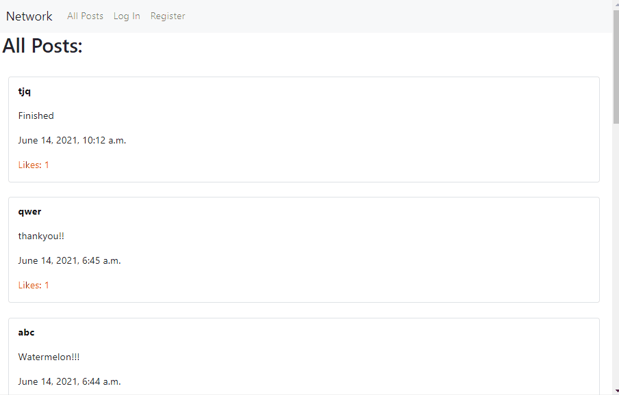

# Django Social Media Server

Developed a backend `❤️ Social Media` server using django

Users will be able to:

Login Authentication

1. Create account
2. Login to account

Post

1. Like / Unlike Posts
2. Edit Posts
3. Create Posts
4. Pagination

Profile

1. View posts by profile
2. View posts by follower
3. Follow / Unfollow a person

 

## Demo

 

## To run the server

- Make sure you have `django` installed
- Run `py manage.py migrate`
- Run `py manage.py runserver`

 